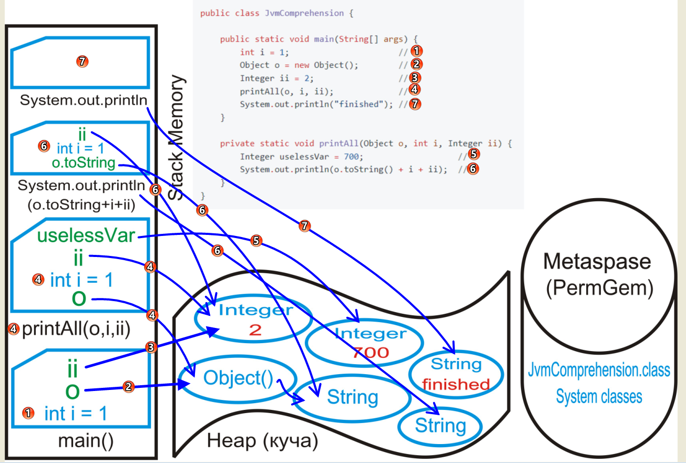

# Этапы работы JVM с кодом
***
В первую очередь подсистема загрузки классов **ClassLoader**, определяет какие классы
присутствуют в коде. Находит их и загружает в область памяти **Metaspase (PermGem).**
На этом этапе также происходит подготовка классов к
выполнению:
* проверка, что код валиден,
* подготовка примитивов в статических
полях,
* связывание ссылок на другие классы.

Metaspace (в прошлом PermGen) - область памяти, где хранится мета-информация:
* данные о классе (имя, методы, поля и др);
* константы.
## Области памяти

Когда в Metaspace все подготовлено к работе программы, в **Stack** помещается фрейм - main()

1 Строка. Примитивный тип данных - память выделяется в фрейме (Stack)

2 Строка. Создается ссылка на объект. Сам же объект помещается в кучу.

3 Строка. Создается ссылка на ссылочный тип данных. Ссылочные данные помещаются в кучу.

4 Строка. В Stack помещается фрейм **printAll()** В нем создается ссылки(o,ii) на объект из кучи, 
а так же копируется еще один примитивный тип данных.

5 Строка. В методе **printAll()** создается ссылка, указывающая, на ссылочный объект в кучи.

6 Строка. В Stack помещается метод **System.out.println** который принимает ссылки на объекты из кучи 
и копирует еще один примитивный тип данных.

7 Строка. В Stack помещается еще один **System.out.println** который указывает на ссылочный объект из кучи.

Далее движок выполнения выполняет код (байт-код в .class) строка за строкой. Методы компилируются в машинный код прямо
во время выполнения. Так же движок выполнения периодически собирает объекты из памяти
(хипа), которые больше не используются (происходит **Сборка мусора**)

Недостижимые объекты удаляются.
А достижимые обычно группируются по времени жизни (эти группы
называют поколения) - чем дольше объект живёт, тем реже проверяют,
нужно ли его удалить.